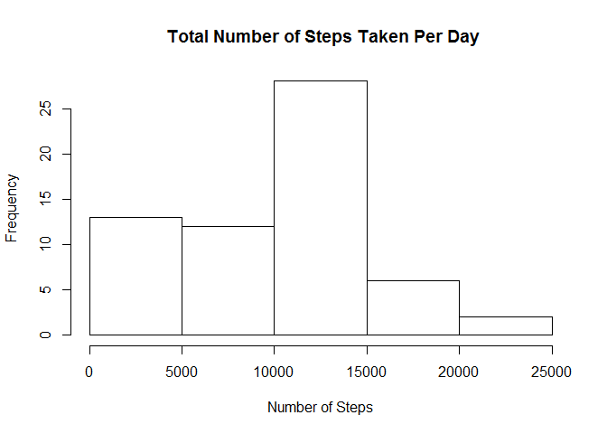
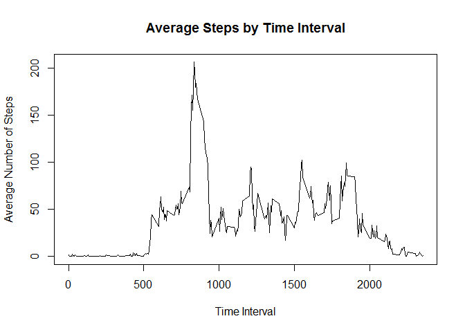
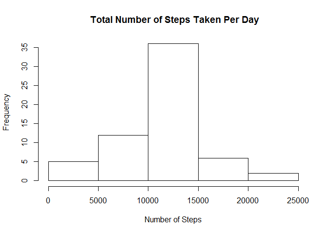
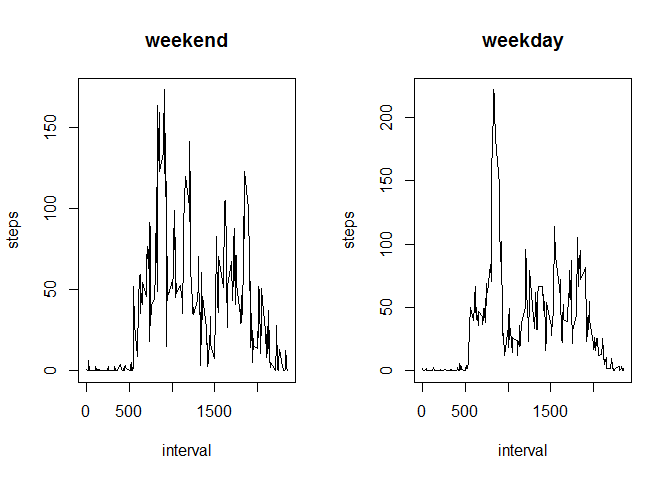

# Reproducible Research: Peer Assessment 1

This assignment makes use of data from a personal activity monitoring device. This device collects data at 5 minute intervals through out the day. The data consists of two months of data from an anonymous individual collected during the months of October and November, 2012 and include the number of steps taken in 5 minute intervals each day.


The variables included in this dataset are:

1. **steps**: Number of steps taking in a 5-minute interval (missing values are coded as NA ) 
2. **date**: The date on which the measurement was taken in YYYY-MM-DD format 
3. **interval**: Identifier for the 5-minute interval in which measurement was taken

## Loading and preprocessing the data


```r
rm(list = ls())
unzip("activity.zip")
activity <- read.csv("activity.csv", header = TRUE)
activity$date <- as.POSIXct(activity$date)
```

## What is mean total number of steps taken per day?


```r
dailysteps <- aggregate(activity$steps, by = list(activity$date), sum, na.rm = TRUE)
hist(dailysteps$x, main = " Total Number of Steps Taken Per Day", xlab = "Number of Steps")
```

 

Here are the mean and median of the total number of steps taken per day :


```r
mean(dailysteps$x) 
```

```
## [1] 9354.23
```

```r
median(dailysteps$x)
```

```
## [1] 10395
```

## What is the average daily activity pattern?

Make a time series plot of the 5-minute interval (x-axis) and the average number of steps taken, averaged across all days (y-axis)


```r
mean_interval <- aggregate(steps ~ interval, data = activity, FUN = mean)
plot(mean_interval$interval, mean_interval$steps, type = "l", main = "Average Steps by Time Interval", xlab = "Time Interval", ylab = "Average Number of Steps")
```

 

Which 5-minute interval, on average across all the days in the dataset, contains the maximum number of steps?


```r
mean_interval[which.max(mean_interval$steps), ]$interval
```

```
## [1] 835
```

## Imputing missing values

There are a number of days/intervals where there are missing values (coded as NA). The presence of missing days may introduce bias into some calculations or summaries of the data.

Calculate and report the total number of missing values in the dataset.


```r
sum(is.na(activity))
```

```
## [1] 2304
```

Devise a strategy for filling in all of the missing values in the dataset. **Use the mean for that 5-minute interval.** Make a histogram of the total number of steps taken each day.


```r
data2 <- activity
for (i in 1:nrow(data2)) {
    if (is.na(data2[i, 1])) {
        data2[i, 1] <- subset(mean_interval, interval == data2[i, 3])$steps
    } 
}

dailysteps2 <- aggregate(data2$steps, by = list(activity$date), sum, na.rm = TRUE)
hist(dailysteps2$x, main = " Total Number of Steps Taken Per Day", xlab = "Number of Steps")
```

 

Calculate and report the mean and median total number of steps taken per day.

```r
mean(dailysteps2$x) 
```

```
## [1] 10766.19
```

```r
median(dailysteps2$x)
```

```
## [1] 10766.19
```

## Are there differences in activity patterns between weekdays and weekends?

```r
whichday <- function(date) {
    if (weekdays(as.Date(date)) %in% c("Saturday", "Sunday")) {
        "weekend"
    } else {
        "weekday"
    }
}
activity$whichday <- as.factor(sapply(activity$date, whichday))

par(mfrow = c(1, 2))

for (type in c("weekend", "weekday")) {
    steps.type <- aggregate(steps ~ interval, data = activity, subset = activity$whichday == 
        type, FUN = mean)
    plot(steps.type, type = "l", main = type)
}
```

 
